footer: Community to the Python Power — Indy.Code() 2018
theme: IndyPy, 0

[.hide-footer]

# [fit] Community to the Python Power

## **10 years of IndyPy**

---

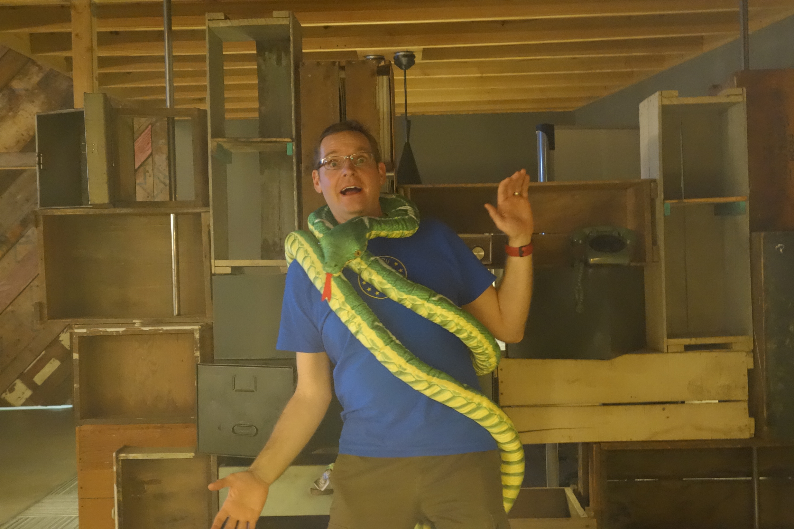

# [fit] Calvin Hendryx-Parker

## [fit] Six Feet Up CTO and Co-Founder
### IndyPy and IndyAWS Organizer

^ 18 years using Python, 11 organizing the IndyPy group

---

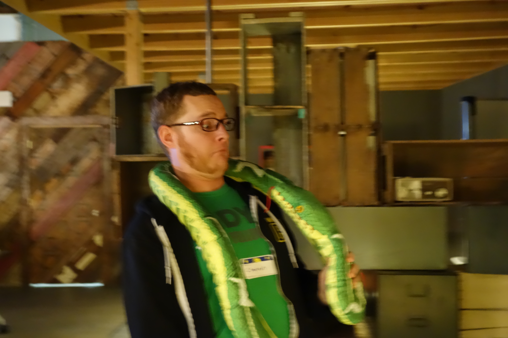

# ~~10~~ **11** Years of IndyPy

^ 11 actaully

---

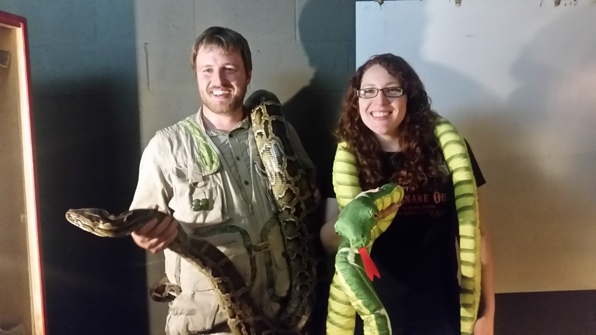

---

# Where to
## [fit] Start?

^ don't get discouraged, first years were lean, but quality
  Stay consistent, don't get discouraged
  We still to this day have new members at each meeting

---

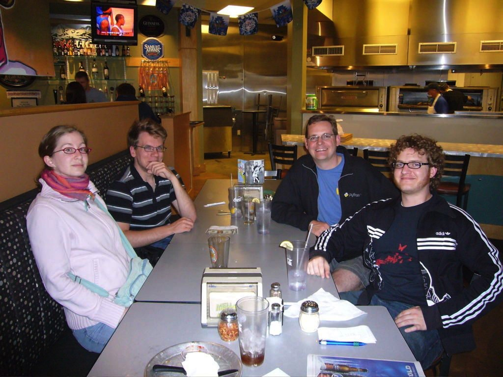

---

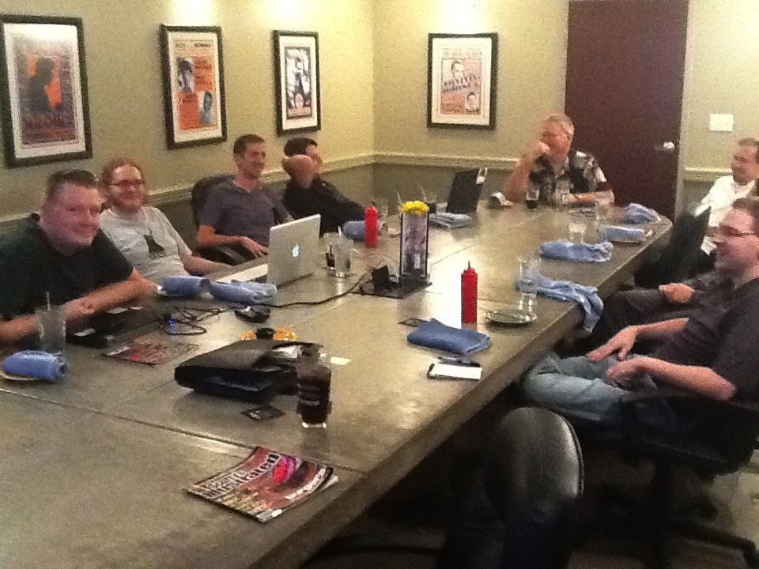

---

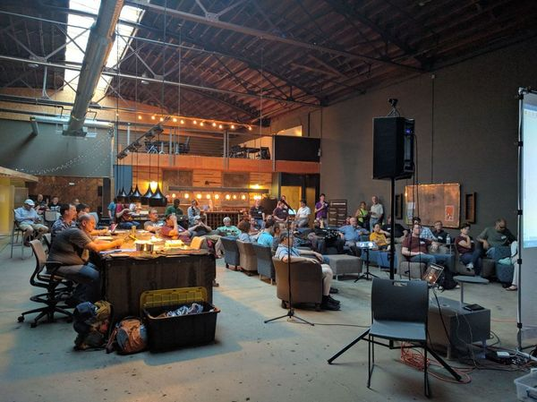

---

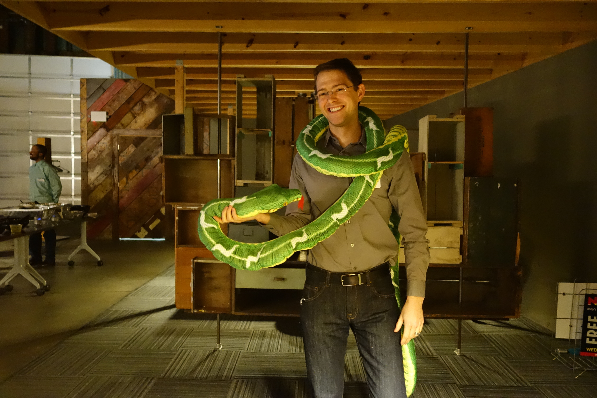

---

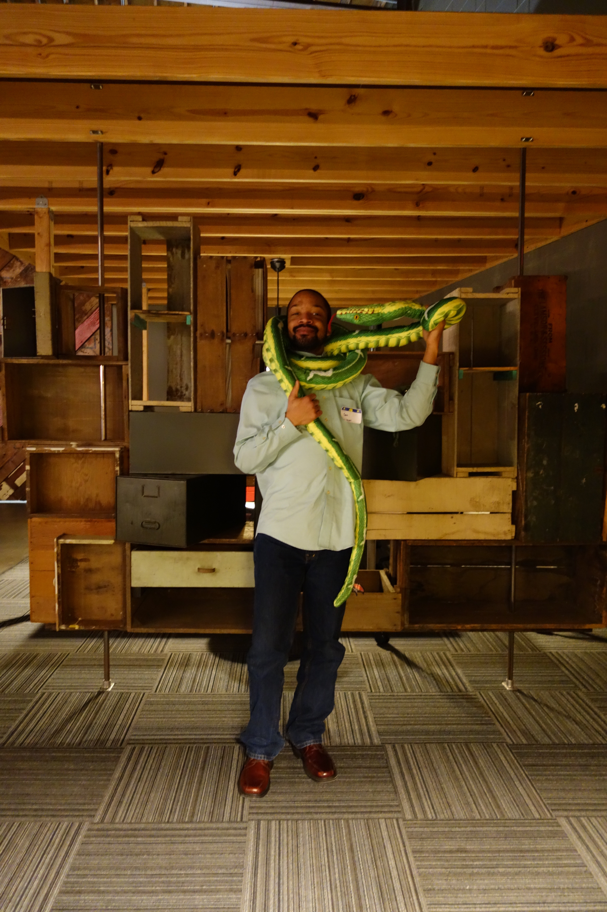

# Tips

* **Consistency**

---

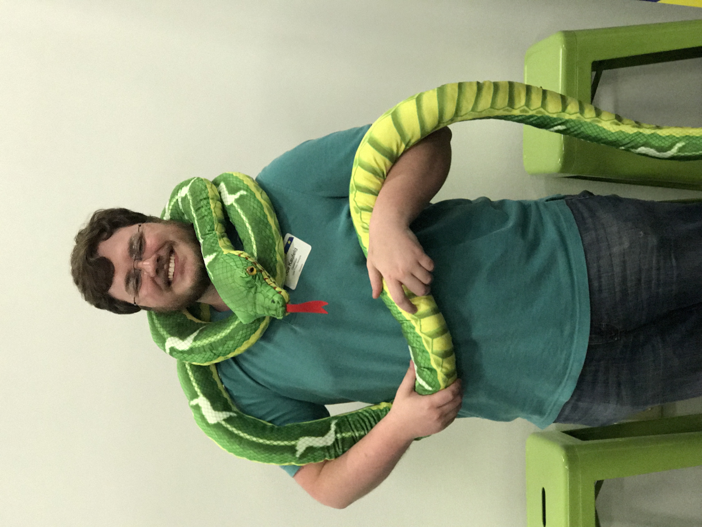

# Tips

* Start Slow
* Build Up
* Gather Feedback
* Serve the Community

^ We are here to serve first
  Some folks just need a "safe" place to come hang out

---

# Must Haves!

* Code of Conduct
* Easy to Access Location

---

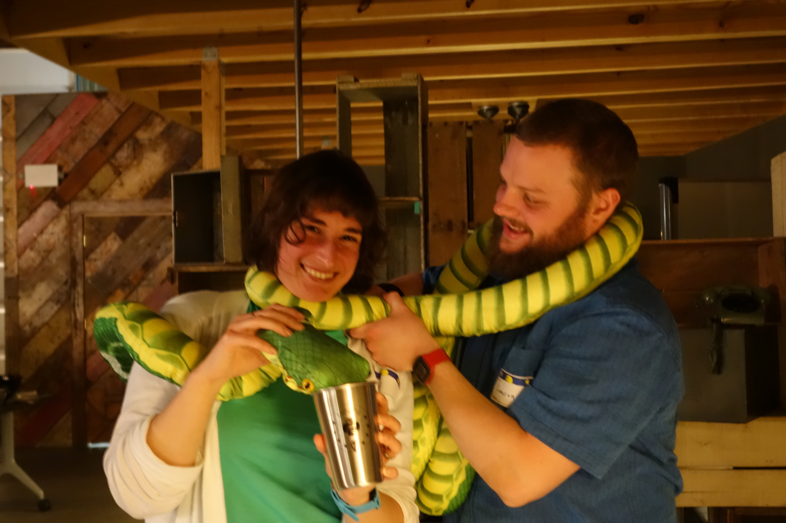

---

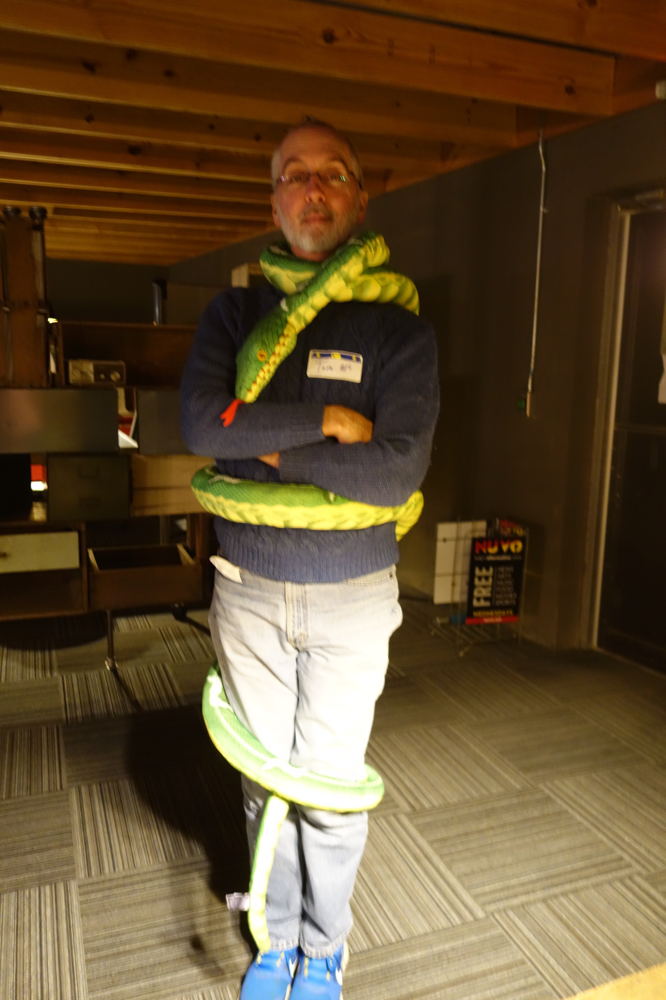

# Sponsors

* Fiscal Sponsorship via Python Software Foundation
* Organizing Sponsorship by Six Feet Up
* Cast of Many Others Sponsoring Now

/Meetups/IndyPy/Sponsor Logos/Clear_new_font_software.png) /Meetups/IndyPy/Sponsor Logos/cp_icon_640x640.jpg) /Meetups/IndyPy/Sponsor Logos/eleven-fifty-primary.png) /Meetups/IndyPy/Sponsor Logos/Insperity_tag_CMYK.JPG) /Meetups/IndyPy/Sponsor Logos/Ivy-Tech-Vertical-Logo-Green.jpeg)
/Meetups/IndyPy/Sponsor Logos/logo.png) /Meetups/IndyPy/Sponsor Logos/NoStarch_logo.jpg) /Meetups/IndyPy/Sponsor Logos/PS_logo_F-11.png) /Meetups/IndyPy/Sponsor Logos/rook-black-2016.png) /Meetups/IndyPy/Sponsor Logos/sixfeetup-logo-1.png)

^ PSF makes taking money much easier

^ Six Feet Up pay its people to do the heavy lifting

---

# [fit] Creative Marketing

* NPR Ads for Pythology
* Booths at Local Conferences
* Community Sponsorship of Events

---

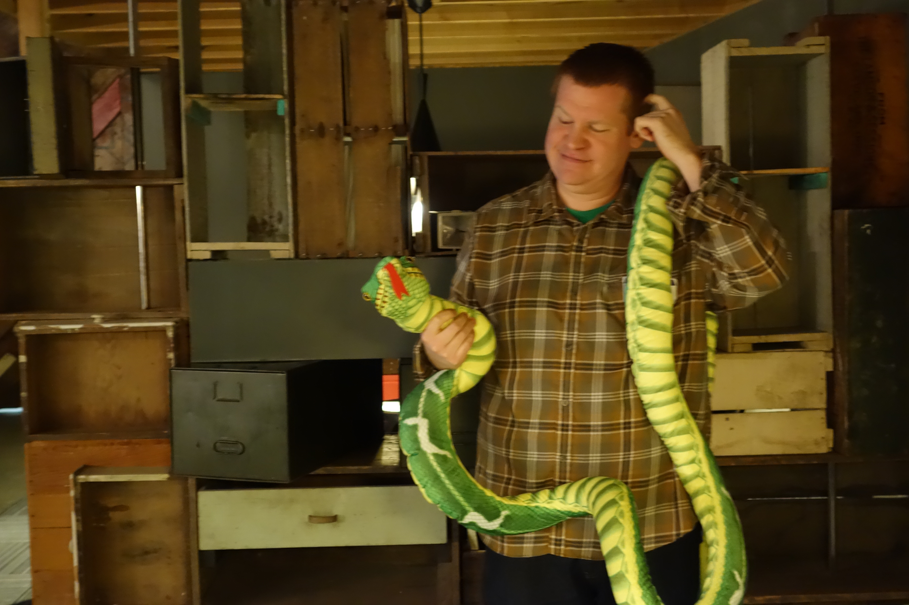

### **11** Years
### **1,262** Members
### **139+** Events
### **11** Sponsors
### **60+** Attendees on Average
### **1,000s** of :pizza:

---

# [fit] Swag!

---

# Sharing Content

<!--
# [fit] Sharing Content

-->

---

---

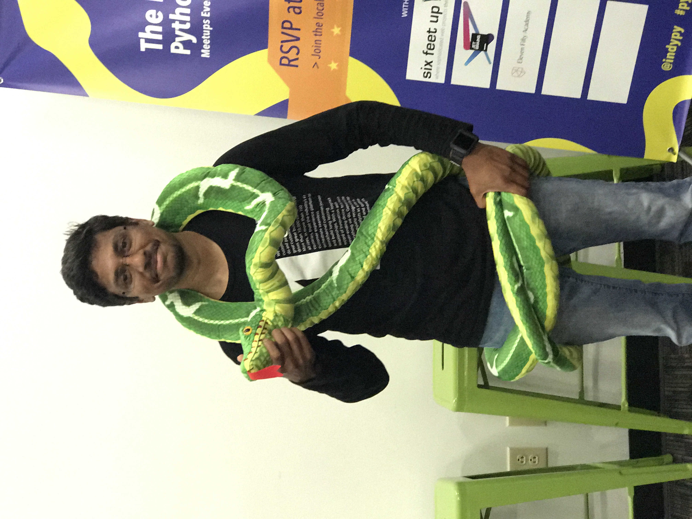

# Where we are now

* Quarterly Pythology:tm: Events
* Python Squad:tm: (Office Hours)
* Python Beginners' Jam:tm:
* Right Brain:tm:
* Pro Talk:tm:

---

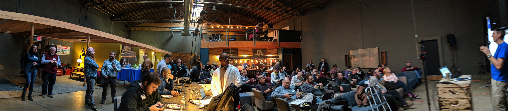

---

# Leveraging Lessons Learned
## [fit] IndyAWS

---

# Adapted for New Audience

* Lunch Format
* Technology/Vendor Specific

---

# [fit] Questions?
## [@calvinhp](https://twitter.com/calvinhp)
### [calvin@sixfeetup.com](mailto:calvin@sixfeetup.com)

<http://IndyPy.org>

<http://IndyAWS.org>

